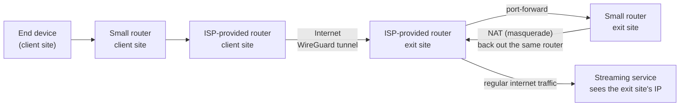

# Multi-Site WireGuard Egress Consolidation for Household-Based Streaming Verification

Routes traffic from several physically separate locations through a single "exit" location's internet connection, so that from a streaming service's point of view every device appears to connect from the same household IP.

## Why

Netflix flags an account as "used outside the household" when a device connects from an IP address that differs from the one registered as the primary home. This project makes devices at multiple sites authenticate as if they were all on the same home network.

Intended usage is brief, not sustained streaming: a device joins its local router's WiFi long enough to authenticate and start playback, then switches back to that location's normal, direct internet connection. The tunnel isn't needed again until the next periodic household check.

## Architecture

Every site runs a small consumer-grade router, not a modem — each one, including the exit site, sits behind its own ISP-provided router and gets connectivity that way. None of them has a public IP directly on its own interface. At the exit site, the ISP router forwards the VPN port to the small router acting as the tunnel endpoint.

A packet's real path crosses the exit site's ISP router **twice**: once inbound (the forwarded VPN tunnel traffic) and once outbound (the de-encapsulated traffic on its way to the streaming service), since that's the only path to the internet available at that site.

## Components

- **WireGuard** on each small router, tunneling to the exit site.
- **A dedicated tunnel subnet**, distinct from every site's own local network, with one fixed address per router.
- **Dynamic DNS** for the exit site, since a typical residential connection doesn't have a static public IP — a scheduled script keeps a hostname updated whenever the exit site's public IP changes, plus a periodic forced update to keep a free DDNS provider's hostname from expiring.
- **Automatic failover on the default route**: each client site pings the tunnel gateway periodically and adjusts its default route's administrative distance — preferring the tunnel when it's up, falling back to the direct connection when it isn't. Without this, a client site would lose all internet access whenever the tunnel dropped.
- **A host route to the exit site's current public IP, sent via the direct connection rather than the tunnel** — necessary to avoid a routing loop (you can't reach the tunnel's own endpoint through the tunnel itself).
- **Persistent keepalive on every tunnel peer.** This turned out to be essential, not optional: because every site (including the exit site) sits behind carrier/ISP-grade NAT, the NAT's UDP mapping can expire from inactivity, causing the tunnel to drop and repeatedly renegotiate its handshake — disruptive, and on weak hardware, computationally expensive. A short keepalive interval prevents the NAT mapping from ever expiring.
- **Inbound firewall hardening** on each router's internet-facing interface: allow only replies to connections the router itself initiated, traffic from the local network, traffic from the tunnel, the tunnel's own raw handshake port, DHCP client renewal traffic, and ICMP; drop everything else from the internet-facing side. Two things are easy to miss here and will break the deployment if overlooked: the tunnel's raw UDP port arrives on the internet-facing interface *before* decryption, and DHCP client renewal traffic needs an explicit allowance since it doesn't always match "established/related" connection tracking.
- **TCP MSS clamping**, a defensive measure so large TCP transfers don't silently stall when some link along the path has a smaller MTU than expected (common with PPPoE or mobile broadband) and path-MTU-discovery ICMP messages are filtered somewhere in between.

## Quick start

Requirements: one router at the exit site plus one per client site, all running RouterOS 7.x (WireGuard is built in). Admin access to the ISP-provided router at the exit site, to forward a UDP port. A dynamic DNS hostname for the exit site if it doesn't have a static public IP. `server-reference.rsc` and `client-reference.rsc` in this repository as your starting point.

1. **Pick a tunnel subnet** that doesn't collide with any site's own local network (e.g. `172.16.0.0/24`), and reserve one address per router.
2. **Set up the exit site** from `server-reference.rsc`: import it, then on the router run `/interface wireguard print` to see the private/public key pair it generated. Forward the WireGuard UDP port from the exit site's ISP router to this router's address, and point your DDNS hostname (if used) at that connection.
3. **Set up each client site** from `client-reference.rsc`: import it, fill in the exit site's public key and DDNS hostname/IP as its one peer, and give the client its own tunnel address. Each site needs its own WireGuard keypair — never reuse one.
4. **Register each client on the exit site**: add a `/interface wireguard peers` entry there with the client's public key, a unique tunnel address, and `persistent-keepalive` set (don't skip this — every site sits behind NAT, and without it the tunnel will drop and reconnect repeatedly instead of staying up).
5. **Verify before moving on to the next site**: check `/interface wireguard peers print detail` on the exit site for a recent handshake, confirm the client still has its own LAN/management access after the firewall rules go in (they're scoped to the internet-facing interface only, but confirm it), and let it sit for a while before treating it as done — some failure modes (like a DHCP lease not renewing cleanly) only show up later, not immediately after applying a change.
6. **Repeat per site**, one at a time. Don't rush multiple sites' changes into the same session, and don't stress-test a live router with synthetic traffic — see *Hardware constraints* below for why.

## Hardware constraints

This was built and tested on a MikroTik hAP lite — the cheapest, most basic model in their lineup, a single-core ~650MHz CPU with no crypto acceleration and 32MB of RAM. That hardware turned out to be marginal for the workload: in testing, generating a high volume of synthetic traffic against one of these units caused it to run out of memory and reboot itself, on more than one unit. It's workable for the intended use case (a brief authentication handshake) but has essentially no safety margin under load, and isn't suited to sustained multi-site streaming.

`server-reference.rsc` and `client-reference.rsc` in this repository are ready-to-adapt RouterOS scripts implementing the architecture above, with placeholder values (`<LIKE_THIS>`) in place of anything site-specific — keys, passwords, hostnames, addresses.

Nothing in this setup is specific to that particular model, though — it's all standard RouterOS v7 functionality (WireGuard, firewall, DHCP client, scripting), which any current MikroTik router runs. A more capable model in the same product line (multi-core CPU, more RAM) should run the identical configuration with real headroom instead of running at its ceiling just to handle a handful of keepalive'd tunnels. Worth using better hardware from the start if the deployment is expected to grow past a couple of sites or ever needs to sustain real throughput rather than a brief handshake.
