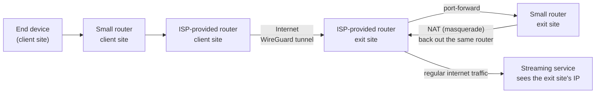
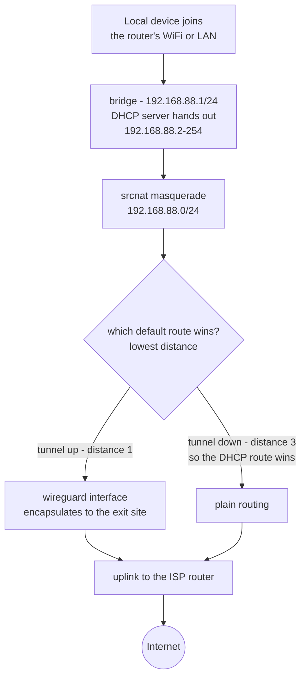
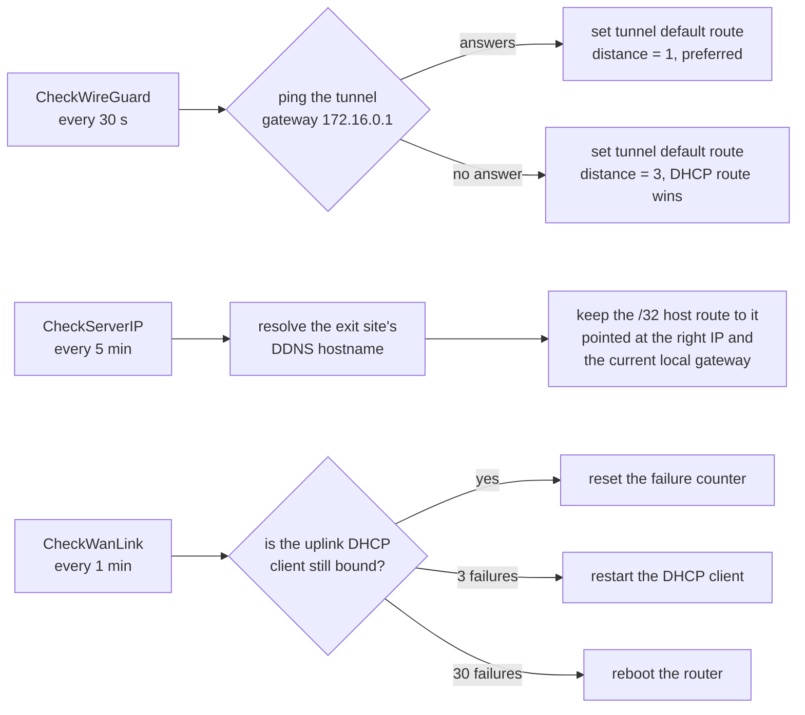
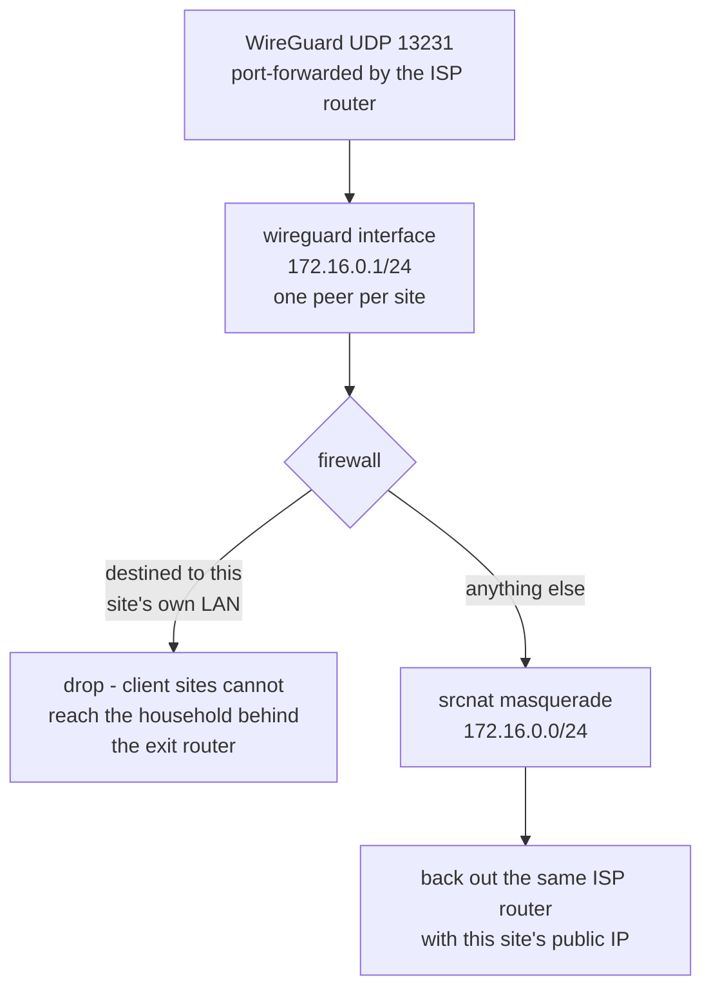
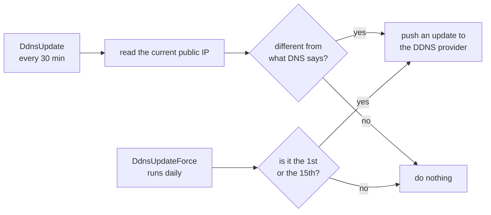

# Multi-Site WireGuard Egress Consolidation for Household-Based Streaming Verification

Routes traffic from several physically separate locations through a single "exit" location's internet connection, so that from a streaming service's point of view every device appears to connect from the same household IP.

## Why

Netflix flags an account as "used outside the household" when a device connects from an IP address that differs from the one registered as the primary home. This project makes devices at multiple sites authenticate as if they were all on the same home network.

Intended usage is brief, not sustained streaming: a device joins its local router's WiFi long enough to authenticate and start playback, then switches back to that location's normal, direct internet connection. The tunnel isn't needed again until the next periodic household check.

## Architecture

Every site runs a small consumer-grade router, not a modem — each one, including the exit site, sits behind its own ISP-provided router and gets connectivity that way. None of them has a public IP directly on its own interface. At the exit site, the ISP router forwards the VPN port to the small router acting as the tunnel endpoint.

A packet's real path crosses the exit site's ISP router **twice**: once inbound (the forwarded VPN tunnel traffic) and once outbound (the de-encapsulated traffic on its way to the streaming service), since that's the only path to the internet available at that site.

## Components

- **WireGuard** on each small router, tunneling to the exit site.
- **A dedicated tunnel subnet**, distinct from every site's own local network, with one fixed address per router.
- **Dynamic DNS** for the exit site, since a typical residential connection doesn't have a static public IP — a scheduled script keeps a hostname updated whenever the exit site's public IP changes, plus a periodic forced update to keep a free DDNS provider's hostname from expiring.
- **Automatic failover on the default route**: each client site pings the tunnel gateway periodically and adjusts its default route's administrative distance — preferring the tunnel when it's up, falling back to the direct connection when it isn't. Without this, a client site would lose all internet access whenever the tunnel dropped.
- **A host route to the exit site's current public IP, sent via the direct connection rather than the tunnel** — necessary to avoid a routing loop (you can't reach the tunnel's own endpoint through the tunnel itself).
- **Persistent keepalive on the client side only.** It's essential on clients: each one sits behind its ISP router's NAT, and without it the NAT mapping expires from inactivity, so the tunnel drops and renegotiates constantly. It is equally important *not* to set it on the server: there it makes the server initiate a handshake every 25 s against peers whose endpoint it doesn't know (any roaming client that isn't currently connected), forever. On a low-power router that alone pinned the CPU at ~100 % permanently; removing it dropped the idle load to 0-3 %.
- **An uplink watchdog on every client.** If the DHCP client on the uplink stops being bound, the router has no address, no route, no tunnel and no way for anyone to reach it remotely. A scheduled script restarts the DHCP client after a few minutes and reboots the router if that doesn't help. Without this, one bad moment on the uplink means someone has to physically travel to the site.
- **Guard every `find` before a `get` in RouterOS scripts.** `/ip route get [/ip route find where ...] x` throws and aborts the whole script when the find matches nothing — which is exactly what happens when the uplink is down, i.e. precisely when the maintenance script most needs to run. Same for `:resolve`, which needs a `:do {} on-error={}` wrapper.
- **Service hardening instead of an inbound firewall.** Each router sits behind the ISP-provided router, which NATs and forwards nothing to it, so its management services are not reachable from the internet to begin with. A "drop everything from the uplink" ruleset therefore defends against an exposure that doesn't exist, while carrying a real risk of locking you out of a device in someone else's home. Disabling the services you don't use (telnet, ftp, www, api) achieves the same practical result with none of that risk. The exception is the exit site, where the VPN port genuinely is forwarded from the internet.
- **TCP MSS clamping**, a defensive measure so large TCP transfers don't silently stall when some link along the path has a smaller MTU than expected (common with PPPoE or mobile broadband) and path-MTU-discovery ICMP messages are filtered somewhere in between.

## How it works inside

The diagram above shows where packets travel between sites. These show what each
router actually does with them, and what keeps it all running unattended.

### Client site: the data path

Everything a local device sends is NATed and then leaves through whichever
default route currently wins. Note that both paths exit through the same
physical uplink — when the tunnel is up, the traffic is simply encapsulated
first.

The failover hinges on three competing default routes and their administrative
distances. Lowest wins:

| Route | Distance | Meaning |
|---|---|---|
| via the tunnel | 1 | set by `CheckWireGuard` while the tunnel answers |
| from the DHCP client | 2 | the site's own internet, always present |
| via the tunnel | 3 | set by `CheckWireGuard` when the tunnel stops answering |

So the tunnel is preferred whenever it works, and the site silently falls back
to its own connection when it doesn't — rather than losing internet altogether.
That is a deliberate choice, not a kill switch: this design values the site
staying online over guaranteeing that traffic never leaves by the local ISP.

### Client site: the three automations

Why each one exists:

- **`CheckWireGuard`** is the failover itself. Without it a dropped tunnel means
  no internet at that site until someone intervenes.
- **`CheckServerIP`** stops the routing loop from breaking. The route to the exit
  site's public IP has to go out the local connection, never through the tunnel,
  and that IP changes because it's behind dynamic DNS.
- **`CheckWanLink`** is the watchdog. If the uplink loses its address the router
  has no route, no tunnel and no remote access, and only a physical visit fixes
  it. This is not hypothetical: it is exactly how one site in the original
  deployment became unreachable.

All three guard every `find` before the `get` that follows it, and wrap DNS
resolution in `:do {} on-error={}`. A RouterOS script that skips those guards
throws and aborts the moment the uplink is down — precisely when you need it.

### Exit site: the data path

Two details worth keeping in mind. The `drop` rule is what stops a client site,
which tunnels everything, from reaching the exit operator's own devices. And
peers here carry **no** `persistent-keepalive`: on the server it makes the router
retry handshakes forever against peers whose endpoint it doesn't know, which on
low-power hardware is enough to pin the CPU permanently.

### Exit site: keeping the hostname current

The first script keeps the hostname pointing at the right address. The second
exists for a different reason: free DDNS accounts expire a hostname that receives
no updates, so it is refreshed twice a month whether the address changed or not.

## Quick start

Requirements: one router at the exit site plus one per client site, all running RouterOS 7.x (WireGuard is built in). Admin access to the ISP-provided router at the exit site, to forward a UDP port. A dynamic DNS hostname for the exit site if it doesn't have a static public IP. `server-reference.rsc` and `client-reference.rsc` in this repository as your starting point.

1. **Pick a tunnel subnet** that doesn't collide with any site's own local network (e.g. `172.16.0.0/24`), and reserve one address per router.
2. **Set up the exit site** from `server-reference.rsc`: import it, then on the router run `/interface wireguard print` to see the private/public key pair it generated. Forward the WireGuard UDP port from the exit site's ISP router to this router's address, and point your DDNS hostname (if used) at that connection.
3. **Set up each client site** from `client-reference.rsc`: import it, fill in the exit site's public key and DDNS hostname/IP as its one peer, and give the client its own tunnel address. Each site needs its own WireGuard keypair — never reuse one.
4. **Register each client on the exit site**: add a `/interface wireguard peers` entry there with the client's public key, a unique tunnel address, and `persistent-keepalive` set (don't skip this — every site sits behind NAT, and without it the tunnel will drop and reconnect repeatedly instead of staying up).
5. **Verify before moving on to the next site**: check `/interface wireguard peers print detail` on the exit site for a recent handshake, confirm the client still has its own LAN/management access after the firewall rules go in (they're scoped to the internet-facing interface only, but confirm it), and let it sit for a while before treating it as done — some failure modes (like a DHCP lease not renewing cleanly) only show up later, not immediately after applying a change.
6. **Repeat per site**, one at a time. Don't rush multiple sites' changes into the same session, and don't stress-test a live router with synthetic traffic — see *Hardware constraints* below for why.

## Hardware constraints

This was built and tested on a MikroTik hAP lite — the cheapest, most basic model in their lineup, a single-core ~650MHz CPU with no crypto acceleration and 32MB of RAM. It has very little headroom: generating a high volume of synthetic traffic against one of these units was enough to make it run out of memory and reboot itself, on more than one unit, so it isn't suited to sustained multi-site streaming.

That said, most of the load we originally blamed on the hardware turned out to be self-inflicted configuration. A misplaced keepalive on the server was burning the CPU on futile handshakes around the clock; once corrected, the same device idles at 0-3 %. Measure before concluding the hardware is the problem — and measure without an SSH session open, because on a CPU this small the key exchange for your own login skews the reading.

`server-reference.rsc` and `client-reference.rsc` in this repository are ready-to-adapt RouterOS scripts implementing the architecture above, with placeholder values (`<LIKE_THIS>`) in place of anything site-specific — keys, passwords, hostnames, addresses.

Each router can reach its ISP router over a cable or over WiFi. Both files use an interface list named `WAN` for the uplink, so switching between the two is a two-line change rather than a rewrite of every rule:

| Role | Uplink | Where |
|---|---|---|
| Server | Ethernet | `server-reference.rsc`, main body |
| Server | WiFi | `server-reference.rsc`, *Alternative: uplink over WiFi* |
| Client | Ethernet | `client-reference.rsc`, main body |
| Client | WiFi | `client-reference.rsc`, *Alternative: uplink over WiFi* |

The client-over-WiFi case has a real constraint worth reading before you commit to it: the hAP lite has one radio, and on a client that radio is already serving the local devices. The file covers both ways out — a wired LAN with the radio used for the uplink (recommended), or repeater mode with its trade-offs.

Nothing in this setup is specific to that particular model, though — it's all standard RouterOS v7 functionality (WireGuard, firewall, DHCP client, scripting), which any current MikroTik router runs. A more capable model in the same product line (multi-core CPU, more RAM) should run the identical configuration with real headroom instead of running at its ceiling just to handle a handful of keepalive'd tunnels. Worth using better hardware from the start if the deployment is expected to grow past a couple of sites or ever needs to sustain real throughput rather than a brief handshake.
